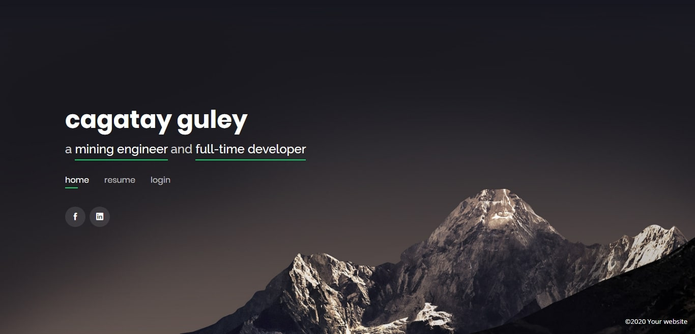

# Cagatay Theme

This is a modified version of the [photo theme](https://www.w3schools.com/w3css/tryw3css_templates_photo2.htm) from w3css.
If you'd like to use this theme, take a look at the w3css classes. You can create nice looking elements this way. A list of examples can be found over on [the w3css documentation](https://www.w3schools.com/w3css/w3css_demo.asp).

Demo: <https://guley.com.tr>
